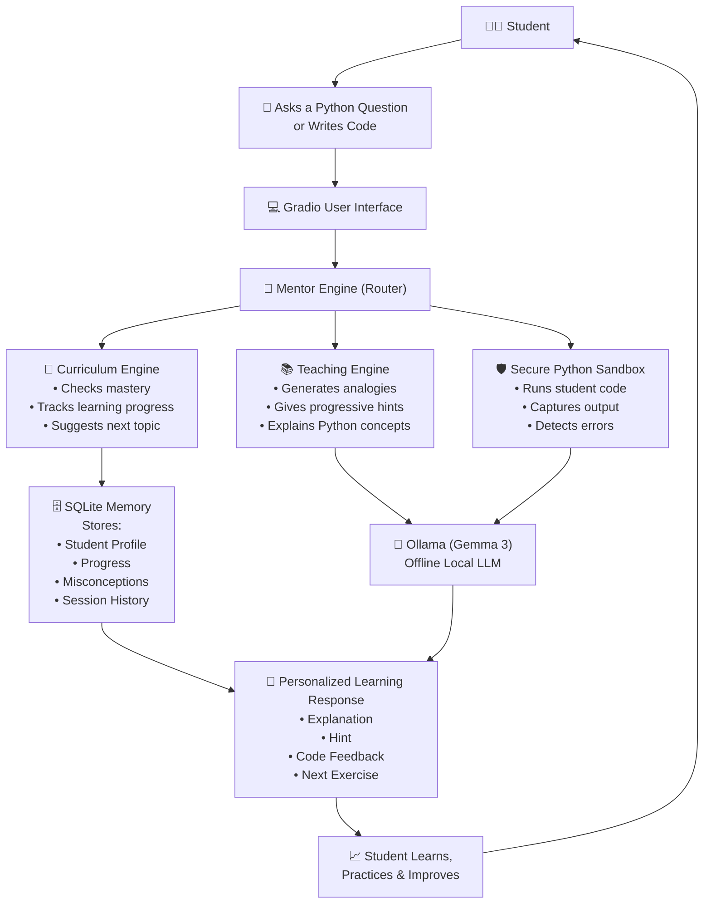

🎓 Skython AI
The Offline Python Mentor
Kaggle AI Agents: Intensive Vibe Coding Capstone Project

Track: Agents for Good (Education)

📖 Overview
Skython AI is an offline-first AI Python mentor that provides students with a personalized, Socratic learning experience without relying on cloud services.

Unlike traditional AI coding assistants that immediately generate solutions, Skython AI guides students through the learning process using progressive hints, debugging conversations, and adaptive teaching techniques.

As an Agent for Good, Skython AI makes high-quality programming education accessible, private, and secure by running completely on the student's own computer.

📌 Project Links
🎥 Video Demonstration: [Insert YouTube / Loom Link]

📒 Kaggle Notebook: [Insert Kaggle Notebook Link]

💻 Local Demo: Follow the installation guide below.

🚀 Why Skython AI?
Learning Python is difficult for beginners because they often:

1. Get stuck without understanding why

2. Depend on copy-paste solutions

3. Need continuous internet access

4. Share personal code with cloud AI services

Skython AI solves these problems by providing an intelligent mentor that:

✅ Works completely offline

✅ Protects student privacy

✅ Teaches instead of solving

✅ Tracks long-term learning progress

⚙️ How Skython AI Works

   ## ⚙️ How Skython AI Works 

🌟 Key Features
🧠 Socratic Mentoring
Skython AI never directly gives away answers.

Instead, it teaches using:

1. Progressive hints

2. Guided questioning

3. Rubber Duck Debugging

4. Step-by-step code tracing

The goal is to help students discover solutions independently.

📚 Structured 3-Part Teaching Model
Every explanation follows the same learning framework:

1️⃣ Relatable Analogy
Explain the concept using an everyday example.

2️⃣ Python Concept
Introduce the actual Python syntax and technical explanation.

3️⃣ Hands-on Exercise
Immediately reinforce learning with a coding activity.

🔒 Secure Offline Sandbox
Students can safely execute Python code inside a restricted local environment without risking their system.

🎯 Curriculum & Mastery Tracking
Skython AI continuously remembers:

1. completed topics

2. misconceptions

3. learning speed

4. strengths

5. weak areas

It then recommends the next lesson automatically.

🤖 AI Agent Architecture
Skython AI implements several ideas from the Kaggle AI Agents course.

Multi-Agent Orchestration
The Mentor Engine intelligently routes requests between:

Teaching Engine

Curriculum Engine

Local Sandbox

using modular Skills such as:

1. analogy_skill

2. hint_skill

3. code_trace_skill

Model Context Protocol (MCP)
An embedded MCP server (mcp/server.py) securely connects the LLM to local tools, enabling it to:

analyze student code,execute sandboxed programs,query learning progress and also
retrieve mastery information.

Persistent State Management
Student progress is stored locally using SQLite (engines/memory_manager.py).

The system tracks:

learning history

misconceptions

success rates

active learning sessions

This enables adaptive teaching across multiple sessions.

💡 The Vibe Coding Journey
Skython AI was developed using the Vibe Coding philosophy with the Antigravity AI agent.

Rather than manually writing every line of code, the application was designed, refined, and validated using natural-language instructions.

Development Process
1. Defined the complete architecture in plain English.

2. The AI agent audited the interface and identified areas for improvement.

3. A structured 3-part teaching framework was introduced.

4. The agent automatically refactored the codebase.

5. System health and functionality were verified.

For the complete development story, see:

docs/ANTIGRAVITY_WORKFLOW.md

🛠 Installation
Because Skython AI is offline-first, it runs entirely on your own computer.

1. Prerequisites
Python 3.10+

Ollama

2. Start the Local LLM
ollama serve
ollama pull gemma3:1b
3. Install Dependencies
pip install -r requirements.txt
Alternatively, Windows users can simply run:

install_and_run.bat
4. Launch Skython AI
python main.py
The interface will automatically open at:

http://localhost:7860
Enter your name and begin learning Python.

🎯 Project Goals
Make Python education accessible offline.

Encourage problem-solving rather than answer memorization.

Preserve student privacy through local AI.

Deliver personalized learning with long-term memory.

❤️ Built for Learners
Skython AI is more than an AI chatbot—it's a mentor that encourages students to think, experiment, debug, and truly understand Python.
